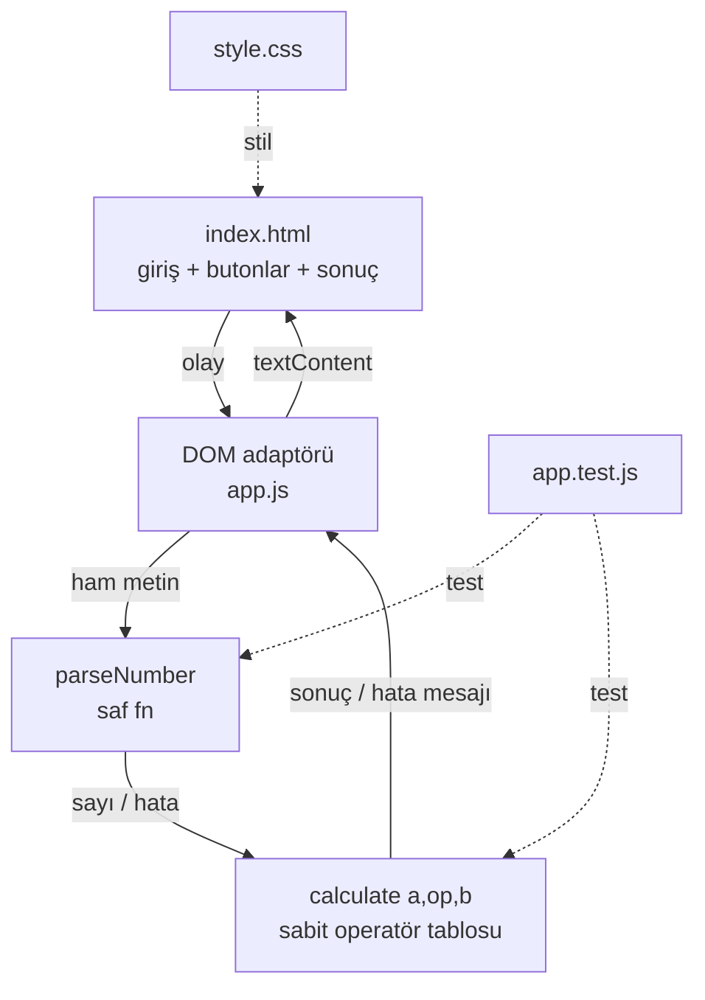
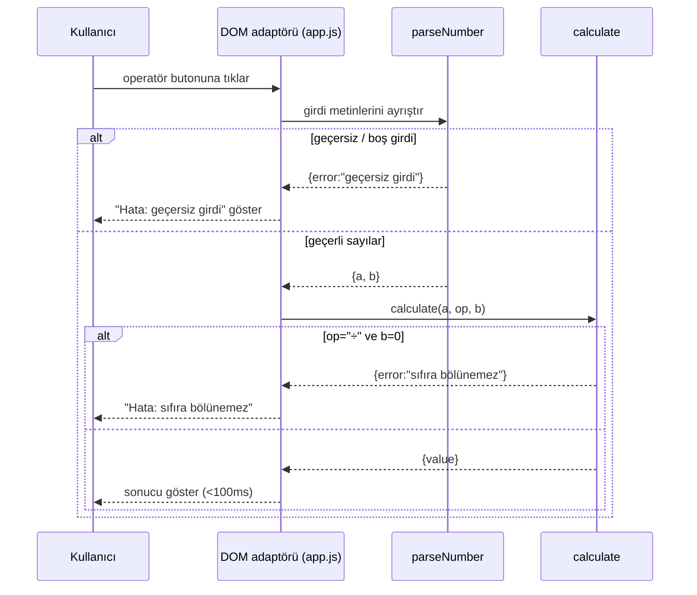

# 05 — Mimari Tasarım: calculator

- Tarih: 2026-07-24 | Mod: AUTOPILOT | Profil: LITE

## Genel yaklaşım
Statik, sıfır-bağımlılık istemci uygulaması (Faz 4 → Alternatif A). Tek `index.html` sayfa,
saf JS mantık katmanı (parser + calculator), DOM render katmanı. Build/bundler/framework YOK.
Hesap mantığı **saf fonksiyonlar** olarak izole → hem güvenlik (eval yasağı) hem test edilebilirlik.

## Dosya yapısı
| Dosya | Sorumluluk |
|-------|------------|
| `index.html` | İskelet: iki sayı girişi, operatör butonları (+ − × ÷), C, sonuç alanı |
| `style.css` | Sunum + responsive layout (mobil/masaüstü) |
| `app.js` | Mantık: `parseNumber()`, `calculate(a,op,b)`, DOM olay bağlama + render |
| `app.test.js` | Saf fonksiyon birim testleri (parser + 4 işlem + hata yolları) |

Not: `app.js` tek dosyada iki katman tutar (parser/calculator saf fn'ler + ince DOM adaptörü);
LITE kapsamda ayrı modül dosyaları gereksiz. Saf fn'ler `export` edilerek testten tüketilir.

## Bileşen görünümü

## Veri akışı

## Veri modeli
Kalıcı depolama yok (durumsuz). Geçici çalışma değerleri:
- Girdi: `{ aRaw:string, bRaw:string, op:'+'|'-'|'×'|'÷' }`
- Sonuç: ayrık birlik → `{ value:number }` VEYA `{ error:string }` (istisna fırlatmadan hata taşınır → NFR-3).
- Operatör tablosu: sabit `{ '+':fn, '-':fn, '×':fn, '÷':fn }` — allowlist; tablo dışı op reddedilir.

## Teknoloji seçimleri
| Katman | Seçim | Alternatifler | DL referansı |
|--------|-------|---------------|--------------|
| Sunum | Vanilla HTML + CSS (responsive, flex/media query) | React/Vite, Alpine/Preact | DL-04-001 |
| Mantık | Saf ES modül JS, elle parse + sabit operatör tablosu | `eval()`/`Function()` (REDDEDİLDİ) | DL-05-001, DL-03-001 |
| Test | Node yerleşik test runner (`node --test`), sıfır dep | Jest/Vitest | DL-05-001 |
| Build/Deploy | Yok — statik dosya servisi | Bundler | DL-04-001 |

## NFR ↔ Mimari eşlemesi (kalite kapısı kanıtı)
| NFR | Mimarideki somut karşılığı |
|-----|-----------------------------|
| NFR-1 Performans (render <1sn, işlem <100ms) | Tek statik `index.html`, bundle/hydrate yok; işlem senkron saf fn (O(1) aritmetik) → <100ms garanti |
| NFR-2 Güvenlik (eval yasağı) | Girdi yalnız `parseNumber()` ile sayıya çevrilir; işlem SABİT operatör tablosundan (allowlist) seçilir; `eval`/`Function`/`new Function` repoda HİÇ yok → kod incelemesi trivial (bkz. DL-05-001) |
| NFR-3 Güvenilirlik (çökmez) | Hata istisna değil, `{error}` birliğiyle taşınır; parser boş/NaN'ı, calculate sıfıra bölmeyi yakalar; saf fn'ler `app.test.js` ile FR-4/FR-5 yollarında test edilir |
| NFR-4 Kullanılabilirlik (responsive) | `style.css` flexbox + `@media` breakpoint; sabit-genişlik/px-taşma yok → mobil/masaüstü bozulmasız |

## ADR listesi
- DL-05-001: Elle tokenize/parse + sabit operatör tablosu; `eval()`/`Function()` mimari düzeyde yasak; test için Node yerleşik runner (sıfır bağımlılık).
- DL-04-001: (Faz 4) Vanilla HTML/CSS/JS yığını seçimi — referans.
- DL-03-001: (Faz 3) NFR-2 eval yasağı kısıtı — referans.

## Kalite kapısı raporu
- "Kritik NFR'lerin mimaride karşılığı var" → ✅ GEÇTİ. NFR-1..NFR-4'ün DÖRDÜ de yukarıdaki
  "NFR ↔ Mimari" tablosunda somut mimari mekanizmaya eşlendi (statik tek dosya; allowlist operatör
  tablosu + eval-yok; `{error}` birliğiyle çökmez hata yolu; flex/media responsive). Kritik kısıt
  NFR-2 (eval yasağı) DL-05-001 ile mimari kurala bağlandı.
