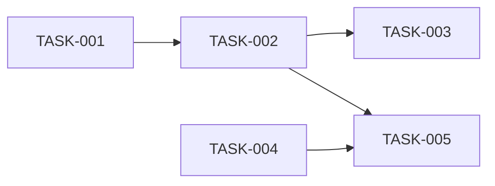

# 08 — Planlama: calculator

- Tarih: 2026-07-24 | Mod: AUTOPILOT | Profil: LITE

> LITE: milestone + önceliklendirilmiş backlog.

## Milestone'lar
| M | Hedef | Kapsanan FR'ler | Hedef tarih |
|---|-------|-----------------|-------------|
| M1 | Çekirdek hesap mantığı (saf fonksiyonlar) + testleri | FR-1..FR-5 | 2026-07-24 |
| M2 | UI (DOM) + hata gösterimi + entegrasyon | FR-1..FR-6 | 2026-07-24 |

## Backlog (önceliklendirilmiş, GitHub Issues formatına uyumlu)

### [M1] TASK-001: Parser (tokenize/parseNumber) — saf fonksiyon
- **Tahmin:** ≤1 gün (gerçekte ~1 saat)
- **Bağımlılık:** —
- **FR:** FR-5
- **Kabul:** Geçerli sayı string'i sayıya çevrilir; boş/NaN girdi `{error}` döner.

### [M1] TASK-002: Calculator (add/subtract/multiply/divide) — saf fonksiyon
- **Tahmin:** ≤1 gün (gerçekte ~1 saat)
- **Bağımlılık:** TASK-001
- **FR:** FR-1, FR-2, FR-3, FR-4
- **Kabul:** 4 işlem doğru sonuç üretir; sıfıra bölme `{error}` döner (istisna fırlatmaz).

### [M1] TASK-003: Birim testleri (node --test)
- **Tahmin:** ≤1 gün (gerçekte ~1 saat)
- **Bağımlılık:** TASK-002
- **FR:** FR-1..FR-5
- **Kabul:** Tüm FR-1..FR-5 senaryoları test edilir, `npm test` yeşil, coverage ≥%70.

### [M2] TASK-004: index.html + style.css (statik iskelet, responsive)
- **Tahmin:** ≤1 gün (gerçekte ~1 saat)
- **Bağımlılık:** —
- **FR:** FR-6, NFR-4
- **Kabul:** Tuş düzeni brief/UI-UX akışına uygun, mobil/masaüstü bozulmasız.

### [M2] TASK-005: app.js DOM adaptörü (parser+calculator'ı UI'a bağlama)
- **Tahmin:** ≤1 gün (gerçekte ~1-2 saat)
- **Bağımlılık:** TASK-002, TASK-004
- **FR:** FR-1..FR-6
- **Kabul:** UI'daki her tuş doğru saf fonksiyonu çağırır; hata mesajları `docs/06-uiux.md` formatında gösterilir; Clear çalışır.

## Bağımlılık grafı (kalite kapısı: çevrimsiz)

## Kalite kapısı raporu
- "Her task 1 günden küçük" → ✅ GEÇTİ (5 task, hepsi ≤1 gün tahminli)
- "Bağımlılık grafı çevrimsiz" → ✅ GEÇTİ (yönlü, döngü yok: 001→002→{003,005}, 004→005)
